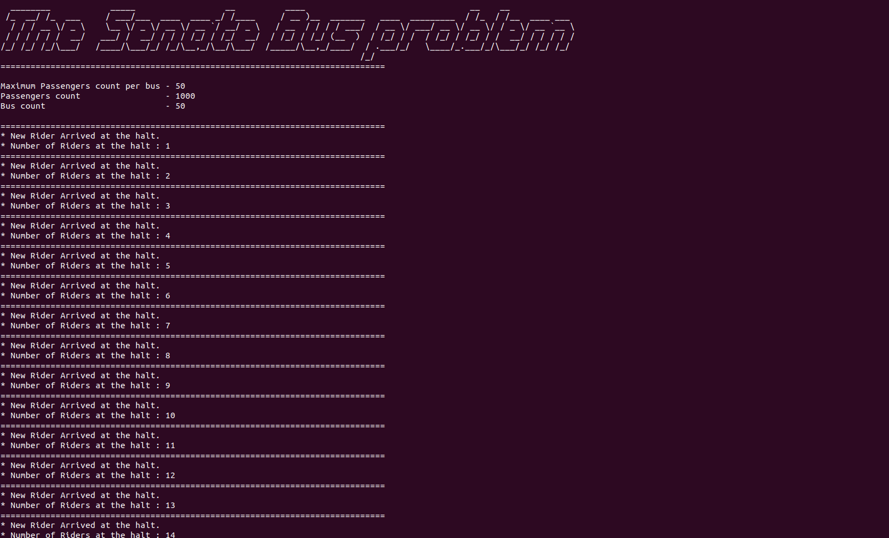
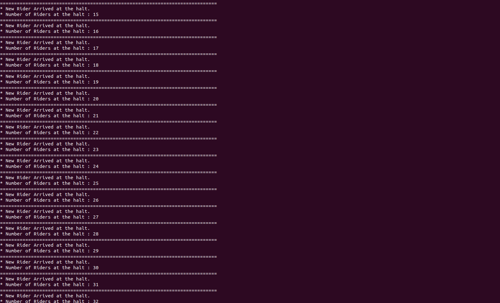
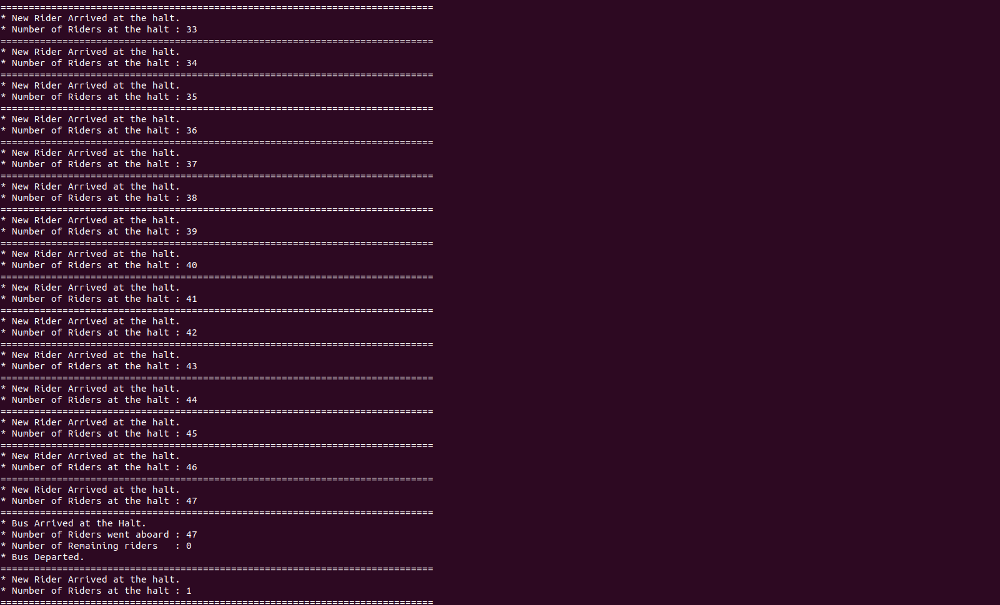
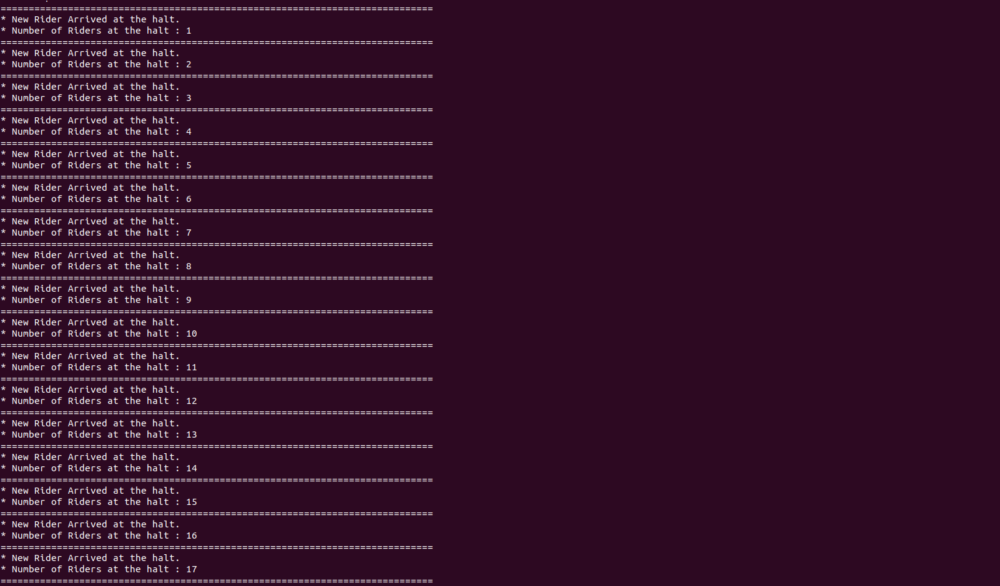
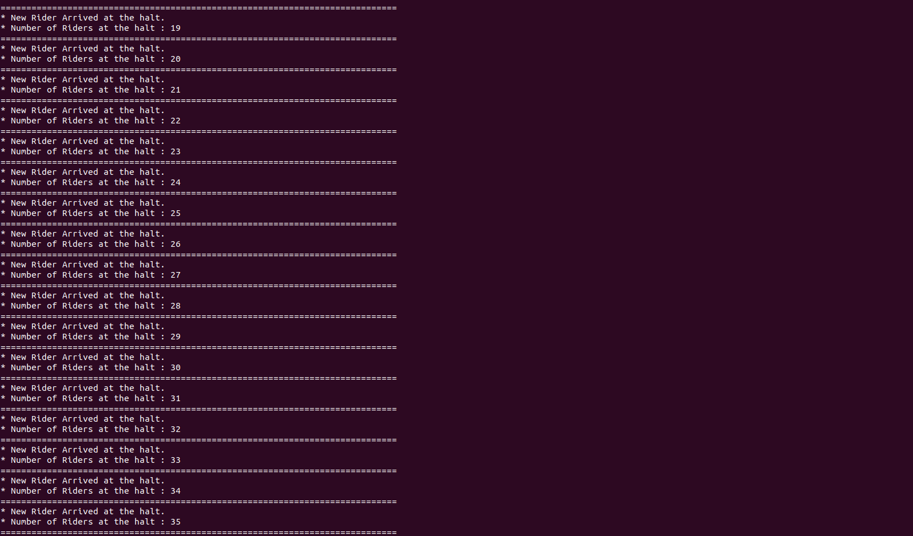
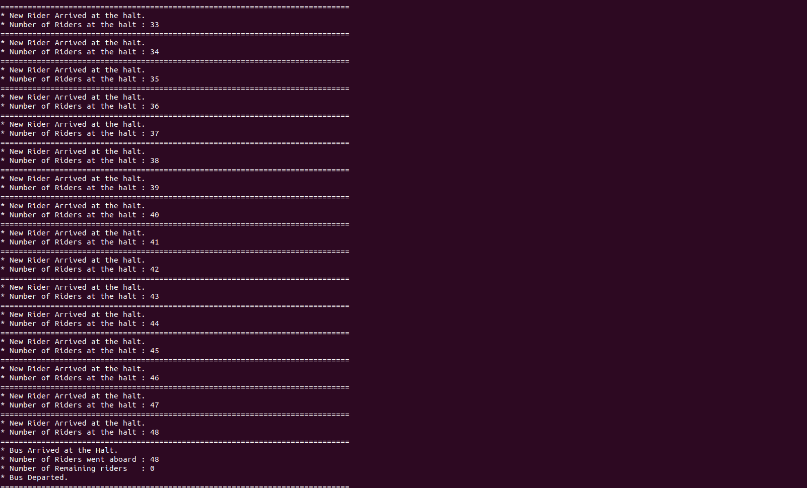

# Senate Bus Problem

## Problem Statement

> This problem was originally based on the Senate bus at Wellesley College. Riders come to a bus
stop and wait for a bus. When the bus arrives, all the waiting riders invoke boardBus, but anyone who
arrives while the bus is boarding has to wait for the next bus. The capacity of the bus is 50 people; if there
are more than 50 people waiting, some will have to wait for the next bus. When all the waiting riders have
boarded, the bus can invoke depart. If the bus arrives when there are no riders, it should depart
immediately.

## Solution Explanation

---
There are 3 entities in this program. They are as follows.

### Bus

Bus has a capacity of 50 passengers and inter arrival time between two bus are exponentially distributed with mean of 20 mins.

### Rider

Riders are arrived at the bus halt.

## Solution Output Screen Shots








### Psudo Code of the Algorithm

#### Variables

```markdown
waiting = 0
mutex = new Semaphore(1)
bus = new Semaphore(0)
boarded = new Semaphore(0)
``` 

#### Bus

```markdown
mutex.wait()
n = min(waiting, 50)
for i in range(n):
    bus.signal()
    boarded.wait()

waiting = max(waiting-50, 0)
mutex.signal()

depart()
```

#### Rider

```markdown
mutex.wait()
  waiting += 1
mutex.signal()
bus.wait()
board()
boarded.signal()
```

## Folder Structure

```bash
src
├── Main.java
├── models
│   ├── BusHalt.java
│   ├── Bus.java
│   └── Rider.java
└── helper
    └── ExponentialDistribution.java
```

## How to Run

1. Go to src directory

```bash
cd src
```

2. Compile the java program.

```bash
javac Main.java
```

3. Run the program

```bash
java Main
```

